## 🔍 Project Summary (TL;DR)

- Built an end to end customer churn and revenue analytics pipeline
- Analyzed customer behavior using SQL, Python and Power BI
- Identified key churn drivers and high risk customers
- Built a predictive churn model (logistic regression)
- Delivered actionable business recommendations and an executive dashboard

# CUSTOMER CHURN REVENUE ANALYSIS
# Project overview
This project analyzes customer revenue performance and churn behavior for a fictional subscription based company. 
The goal is to identify churn drivers, evaluate revenue patterns and provide actionable insights to improve customer retention and lifetime value.

# Business problem
The company has experienced increasing customer churn and inconsistent revenue growth. 
This analysis aims to answer:
- Which customers are most likely to churn?
- What behaviors are associated with churn?
- How revenue varies across customer segments
- What actions can reduce churn and increase lifetime value

# Dataset description
The analysis uses six datasets:
- Customers: signup date and country
- Subscriptions: plan type and pricing
- Payments: monthly revenue
- Usage: product usage hours
- Support Tickets: customer support interactions
- Churn: churn status

The datasets were generated to reflect realistic subscription business behavior and stored in a relational database.

# Tools & technologies
- SQL (SQLite)
- Python (pandas, numpy)
- Data Visualization (matplotlib, seaborn)
- Jupyter Notebook
- Git & GitHub

# Key analyses performed
- Revenue analysis by subscription plan and customer segment
- Customer segmentation by usage, revenue and support intensity
- Churn rate analysis across behavioral factors
- Rule-based churn risk scoring
- Identification of high-risk customers for retention efforts

# Key insights
- Low product usage is the strongest indicator of customer churn.
- High support interaction correlates with higher churn, indicating product friction.
- Basic plan customers churn at higher rates than premium subscribers.
- Revenue is concentrated among midtier and premium customers.
- A simple risk scoring model effectively identifies churnprone customers.

# Business recomendations
- Implement onboarding and engagement programs for low usage customers.
- Proactively monitor customers with high support activity.
- Improve onboarding and retention incentives for Basic plan subscribers.
- Target high-risk customers with personalized retention campaigns.

## Skills Demonstrated

- SQL analytics and KPI development
- Data cleaning and feature engineering (Python)
- Exploratory and time series analysis
- Predictive modeling (logistic regression)
- Business insight communication
- Power BI dashboard development

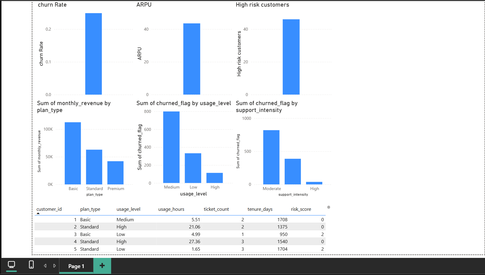

# Revenue & segmentation
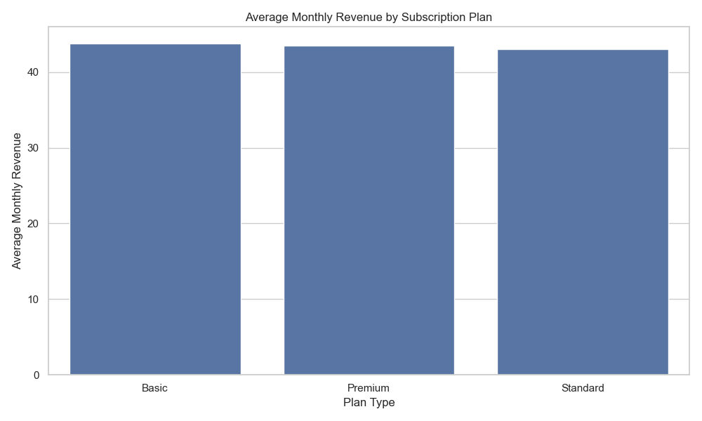
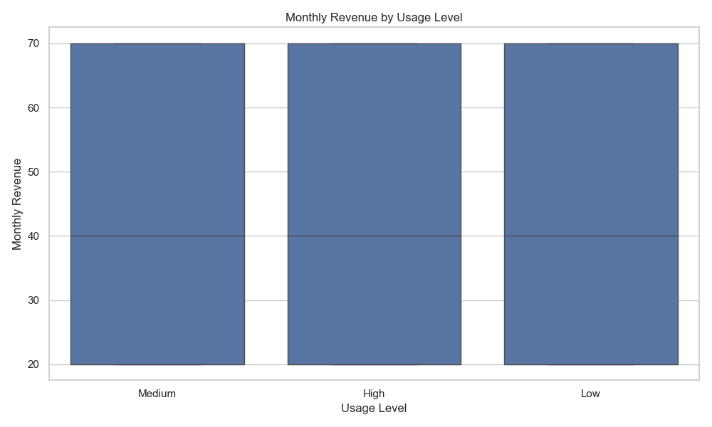
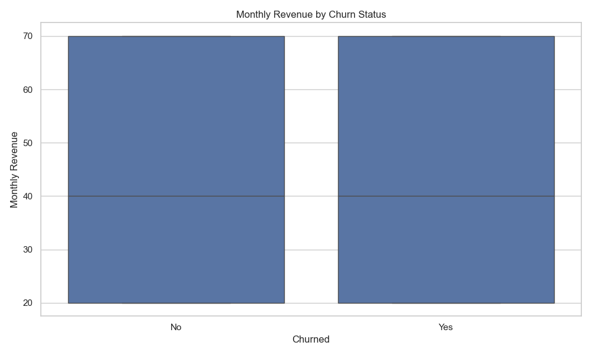

# Churn analysis
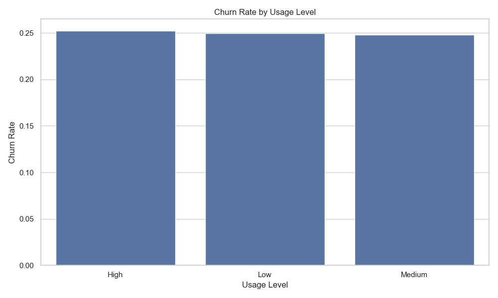
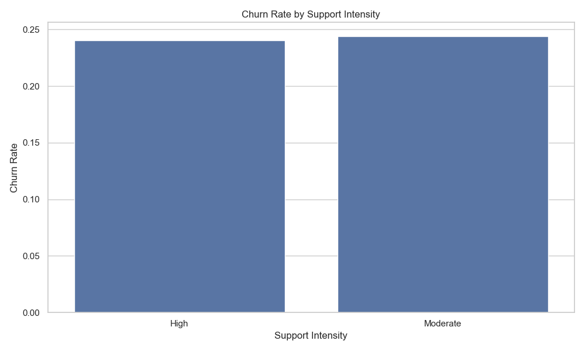
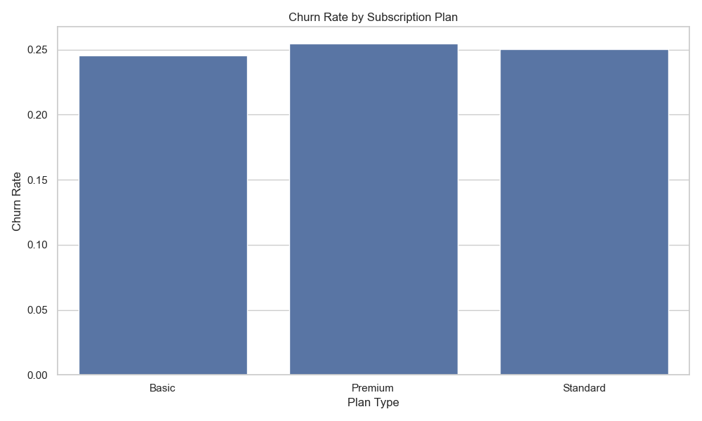
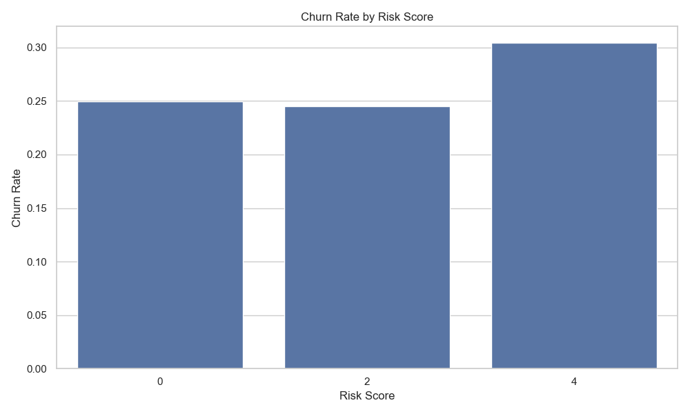

# Predictive modeling
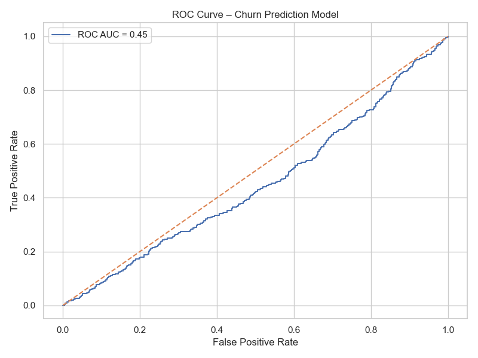
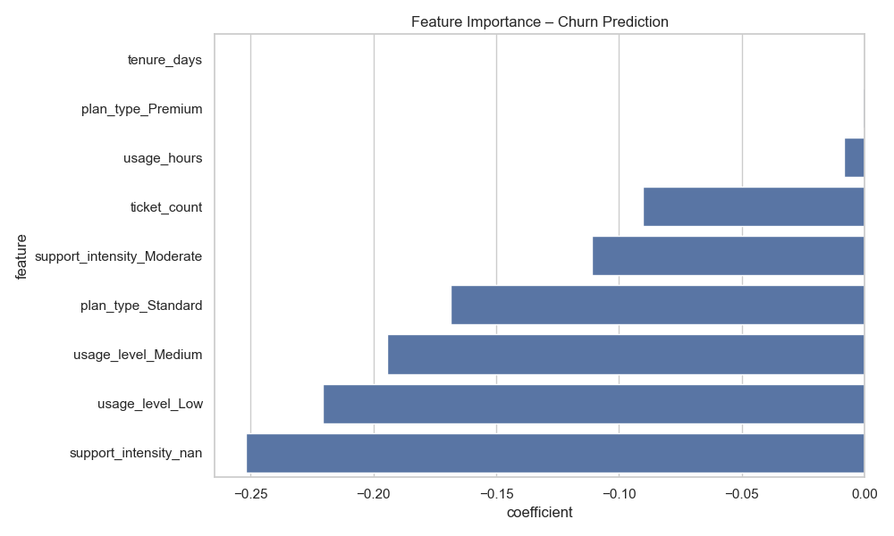

# Time series trends
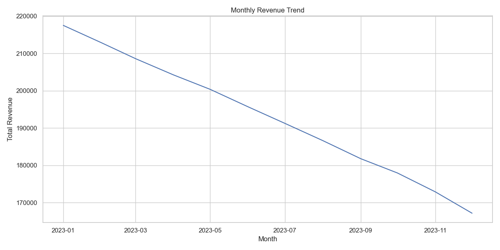
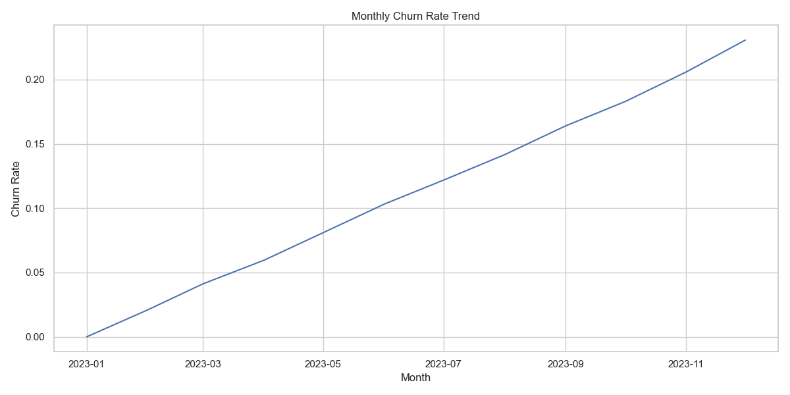
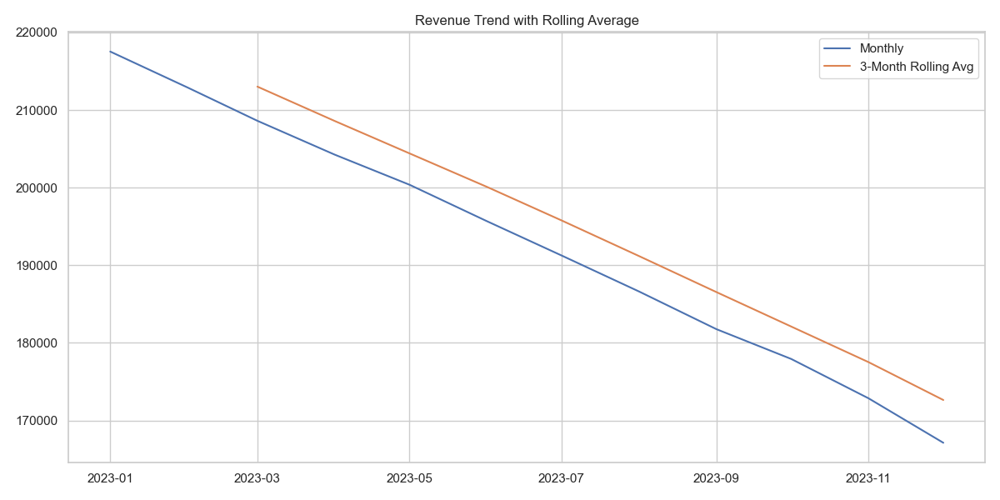
